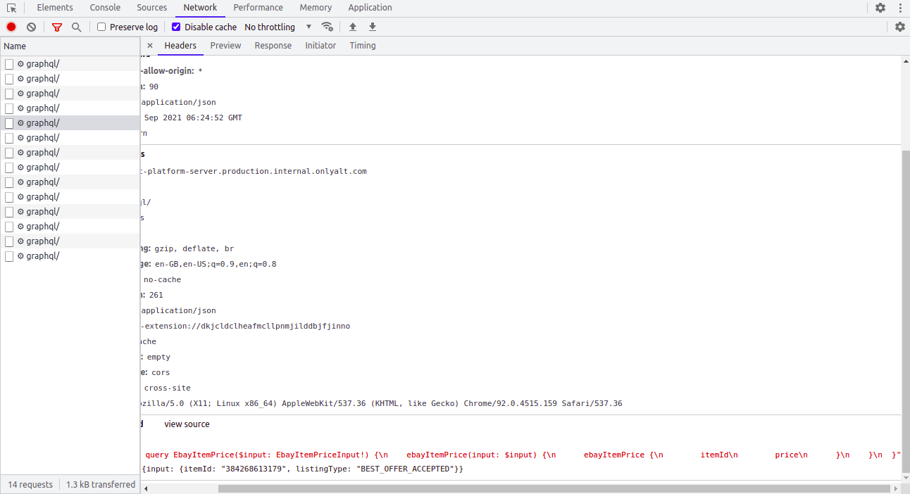
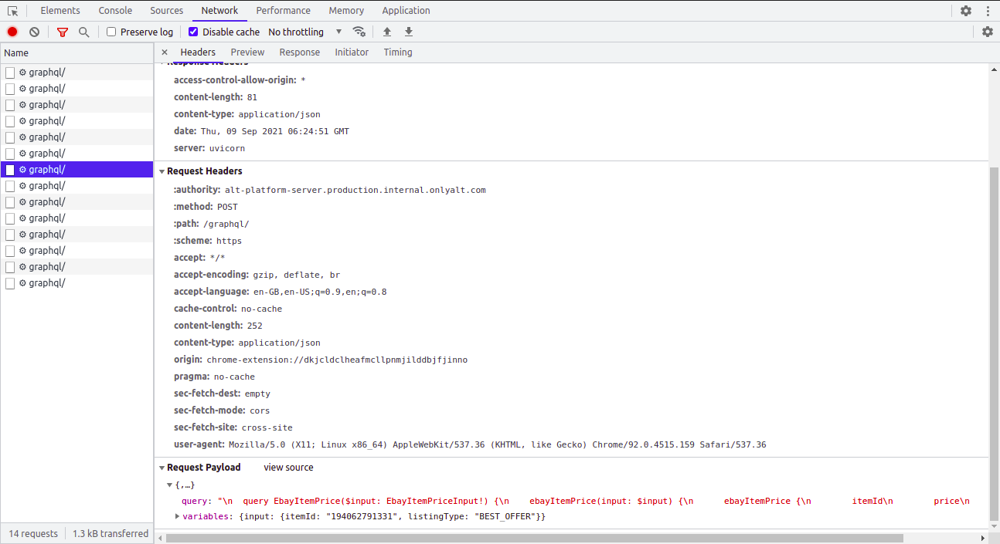

# golang-alt-ebay-api-client
A small Golang script that uses alt extension API request structure to make an API request and receive back the response.

## command line arguments
- item-id : item id 
- listing-type : listing type

## How to run
```go
./main --item-id 353594680204

./main --item-id 384268613179


./main --item-id 373664889722 --listing-type BEST_OFFER_ACCEPTED
./main --item-id 373664889722 --listing-type BEST_OFFER

```

#### please check the exact listing type with the ALT extension when you didn't receive the actual output. We have **BEST_OFFER_ACCEPTED** and **BEST_OFFER** as listing-type in request body.




